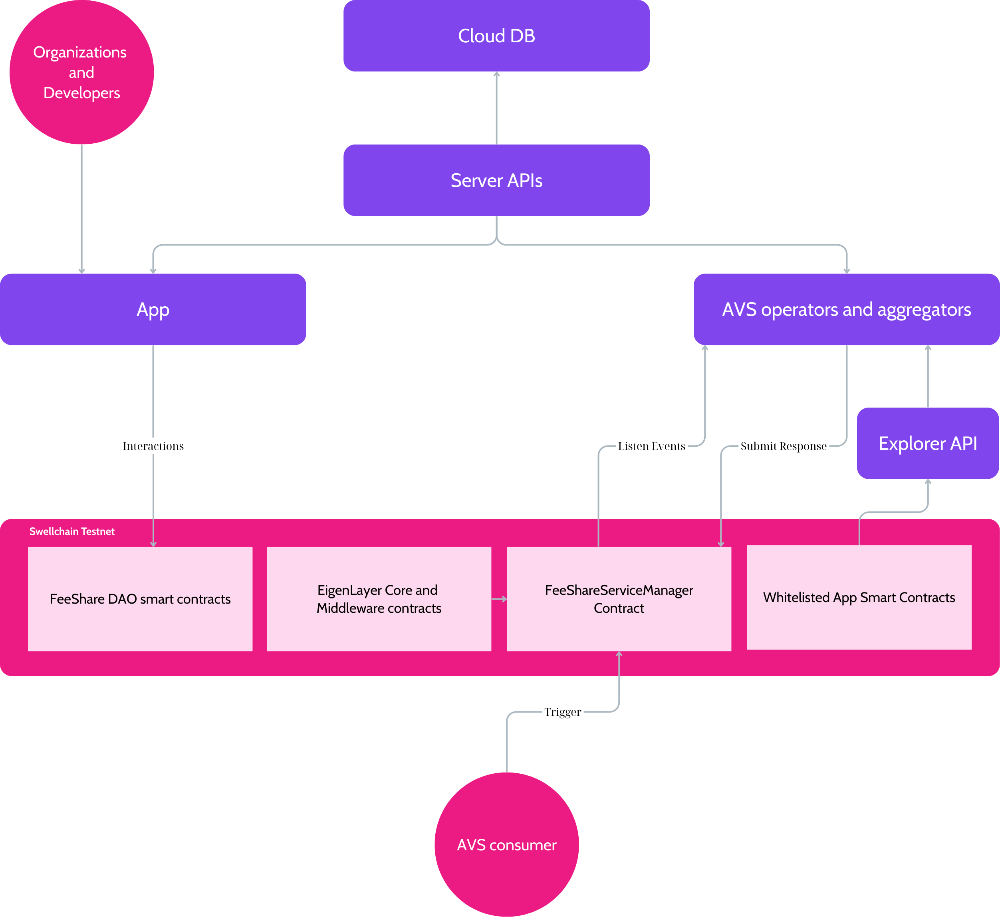
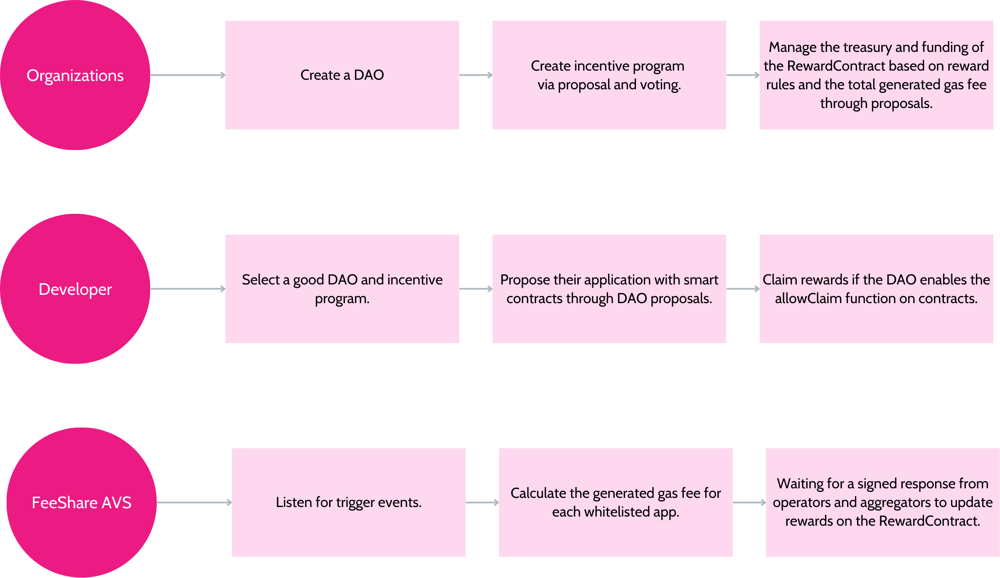
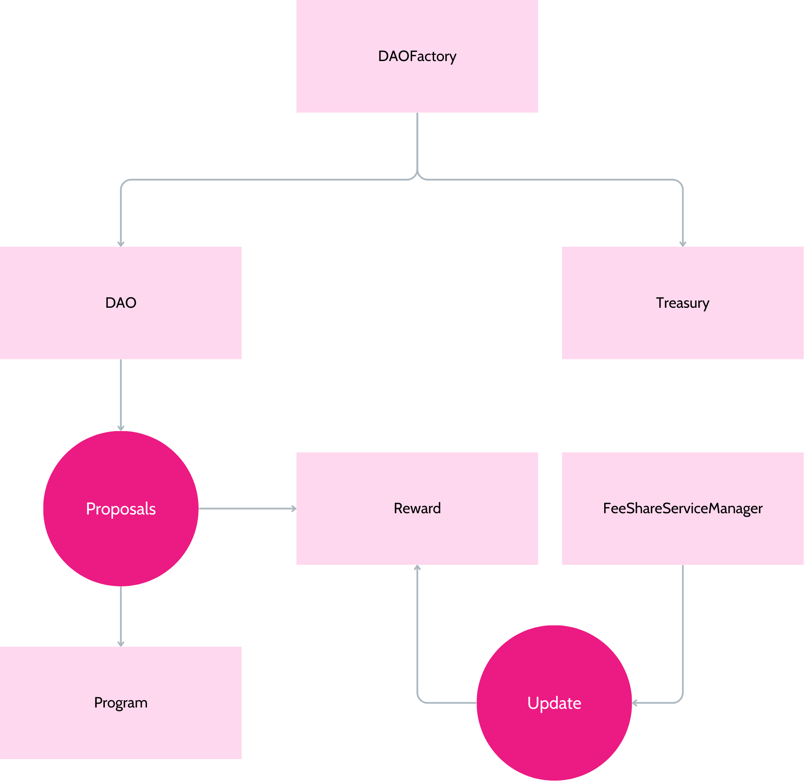

## 1. Introduction
FeeShare is a platform that combines DAO tooling with a new EigenLayer AVS solution to incentivize smart contract developers on the Swellchain network by redistributing a portion of the gas fees their contracts generate. Leveraging the infrastructure of both EigenLayer and Swellchain, FeeShare fosters a decentralized reward mechanism that drives participation and innovation in the ecosystem.

## 2. System Architecture 



- **Cloud Database:** Works as an indexing database that stores data off-chain for fast - - querying and access.
- **Server APIs:** Provide Web2 APIs for the FeeShare App and AVS operators.
- **Application:** Organizations can manage their DAOs, incentive programs, and treasuries. - Developers can propose their applications and claim rewards.
- **AVS Operators and Aggregators:** Listen for trigger events, calculate the total generated gas fees of whitelisted app smart contracts based on block numbers, sign, and submit responses.
- **Smart Contracts:** Include the FeeShare DAO smart contracts, EigenLayer contracts, FeeServiceManagerContract, and all whitelisted app smart contracts.
## 3 Basic Workflow


- **Workflow 01:** Organizations start creating their own incentive program.
- **Workflow 02:** Developers propose their apps to incentive programs.
- **Workflow 03:** FeeShare AVS handles trigger events to calculate rewards.

## 4. Source Code Structure

**[App](/app/)**  
- Contains frontend source code, serving as DAO tooling to connect developers and organizations.  
- Technologies used: Next.js 15, TailwindCSS, Shadcn UI, RainbowKit, Wagmi, Viem, and MongoDB Atlas.

**[AVS](/avs/)**  
- Based on the [HelloWorld template](https://github.com/Layr-Labs/hello-world-avs), it includes AVS contracts and client components, including demo code for the operator and consumer. This will be replaced by the WAVS or Incredible Squaring template in future plans.
- Technologies used: Node.js, Foundry (Forge), EigenLayer core contracts, and Ethers.js.

**[Contracts](/contracts/)**  
- Contains DAO-related smart contracts.  
- Technology used: Foundry.

The source code includes unit tests for both AVS and DAO contracts.


## 5. Smart Contracts

### 5.1. Contract Diagrams


This is a simple diagram that removes complicated data flow between smart contracts.

- **DAOFactory** creates a new DAO by deploying two contracts: DAO and Treasury.

- The **DAO contract** creates a new incentive program via a proposal, which deploys two contracts: Program and Reward.

- **FeeShareServiceManager** is a smart contract that uses EigenLayer core contracts to manage its services. Only this contract can update the generated gas fees and rewards on the RewardContract.


### 5.2. Contract Addresses

|Name|Address|
|--|--|
|**FeeShare AVS**||
|FeeShareServiceManager|[0xEd990FE082feA0FDf01d08D2E3f8982116FD72B3](https://swell-testnet-explorer.alt.technology/address/0xEd990FE082feA0FDf01d08D2E3f8982116FD72B3)|
|**FeeShare DAO core contracts**||
|DAOFactory|[0x40F73724f4FDCEb4512d4f2350D71F9cb02562a6](https://swell-testnet-explorer.alt.technology/address/0x40F73724f4FDCEb4512d4f2350D71F9cb02562a6)|
|ProgramFactory|[0x05BA6d3c3a016a9Fb9Cdb4B4d8C1C453c67Ad069](https://swell-testnet-explorer.alt.technology/address/0x05BA6d3c3a016a9Fb9Cdb4B4d8C1C453c67Ad069)|
|**Examples of contracts generated by the FeeShare app**||
|DAO|[0xE5f87505dd983e513E7c893377edd795294B301B](https://swell-testnet-explorer.alt.technology/address/0xE5f87505dd983e513E7c893377edd795294B301B)|
|Treasury|[0x046f0278f7BEe121903e4326dcF87d5944fa25b7](https://swell-testnet-explorer.alt.technology/address/0x046f0278f7BEe121903e4326dcF87d5944fa25b7)|
|Program|[0x35f6F516650AEfbd49376eFF1b8CE31d1fBAC133](https://swell-testnet-explorer.alt.technology/address/0x35f6F516650AEfbd49376eFF1b8CE31d1fBAC133)|
|Reward|[0x61373EFE8E2D1aB06227C95277317802a063BB97](https://swell-testnet-explorer.alt.technology/address/0x61373EFE8E2D1aB06227C95277317802a063BB97)|
|**EigenLayer core contracts**||
|StrategyManager|[0xe62f209e25d49c99b451975ccd43a7bdf8aed8dc](https://swell-testnet-explorer.alt.technology/address/0xE62f209e25d49c99B451975ccd43A7bDF8AEd8DC)|
|DelegationManager|[0x94039ce3c372efef4e6d7bb95c8a06bdc9bce19a](https://swell-testnet-explorer.alt.technology/address/0x94039ce3c372efef4e6d7bb95c8a06bdc9bce19a)|
|EigenPodManager|[0x40224faad6f4ca638257c0bb90b2f35a2489c510](https://swell-testnet-explorer.alt.technology/address/0x40224faad6f4ca638257c0bb90b2f35a2489c510)|
|AllocationManager|[0x2170343c60ab9ef9788da7a421068c557a8342b8](https://swell-testnet-explorer.alt.technology/address/0x2170343c60ab9ef9788da7a421068c557a8342b8)|
|RewardsCoordinator|[0xc9dbd75fa3a89ecff9e4295be582ffa205847e42](https://swell-testnet-explorer.alt.technology/address/0xc9dbd75fa3a89ecff9e4295be582ffa205847e42)|
|PermissionController|[0x38d69e87815150b1ce6ce3c01486deed02dd6305](https://swell-testnet-explorer.alt.technology/address/0x38d69e87815150b1ce6ce3c01486deed02dd6305)|
|AVSDirectory|[0x69346b77c6bcf3b0bb50749dff3086695a775a8b](https://swell-testnet-explorer.alt.technology/address/0x69346b77c6bcf3b0bb50749dff3086695a775a8b)|


## 6. Installation

💡 **Note:** To run the entire system locally, you need to set up the environment variables first, then deploy the smart contracts to obtain the important addresses, and finally run the frontend application.

### 6.1. Environment Setup
Each source code component needs a .env file to declare environment variables.
#### Application

|Variable|Description|
|--|--|
|**Application**||
|NEXT_PUBLIC_WALLET_CONNECT_PROJECT_ID| Wallet Connect project ID |
|NEXT_PUBLIC_DAO_FACTORY | DAOFactory contract address |
|NEXT_PUBLIC_PROGRAM_FACTORY | ProgramFactory contract address |
|NEXT_PUBLIC_AVS_CONTRACT | FeeShareServiceManager contract address |
| DATABASE_URL| Mongo Atlas Database URL|
|**DAO Contracts**||
|PRIVATE_KEY| Account private key for deploying smart contracts.|
|SENDER | Optional, using in Forge commands|
| RPC_URL | Blockchain network RPC URL|
|**AVS**||
|PRIVATE_KEY| Account private key for running an AVS operator. |
|CONSUMER_PRIVATE_KEY| Account private key for running a AVS consumer |
|OPERATOR_RESPONSE_PERCENTAGE| Response quorum |
|RPC_URL| Blockchain network RPC URL|
|WS_URL|Blockchain network WS URL|
|APP_API_URL| Backend server API, for example: http://localhost:3000/api/|
|CHAIN_ID|Default ChainID|
|NEWTASK_INTERVAL|An interval for the AVS consumer to create a new task.|

### 6.2. Commands

To deploy, test, and customize smart contracts, you need to use Foundry. Some basic installation instructions and commands are [here](contracts/README.md).

#### [DAO Contracts](/contracts/)
- Deploy Commands:
    - `chmod +X deploy.sh`
    - `./deloy.sh`
- Testing Command
    - ```forge test```
    - ```forge test -vvv``` for debugging.


#### [AVS](/avs/)

First, install the Node.js libraries: ```npm i```.

**Contracts**
- Deploy EigenLayer core contracts: ```cd avs/contracts;forge script script/DeployEigenLayerCore.s.sol --rpc-url $RPC_URL --broadcast -vvvv``` or ```npm run deploy:core```
- Deploy FeeShareServiceManager contract: ```cd avs/contracts; forge script script/FeeShareDeployer.s.sol --rpc-url $RPC_URL --broadcast -vvvv``` or ```npm run deploy:fee-share```
- Testing: ```cd avs/contracts; forge test -vvv```

**Client**
- Run AVS operator and aggregator demo: ```npm run start:operator```
- Run AVS consumer demo: ```npm run start:traffic```


#### [Application](/app/)
- Install libraries: ```npm i```
- Dev mode: ```npm run dev```
- Production Mode: ```npm run build; npm run start```


